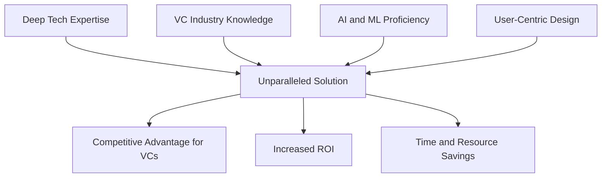
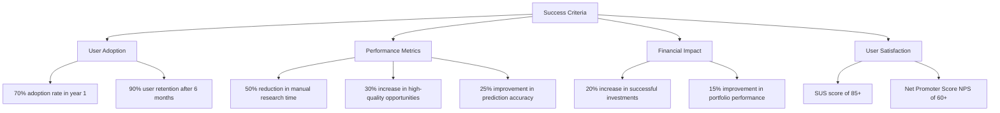
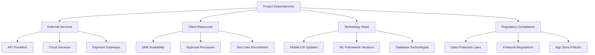
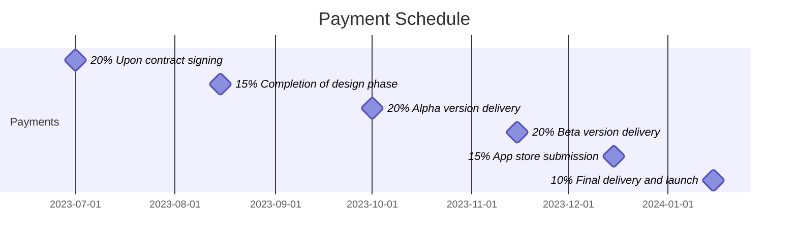
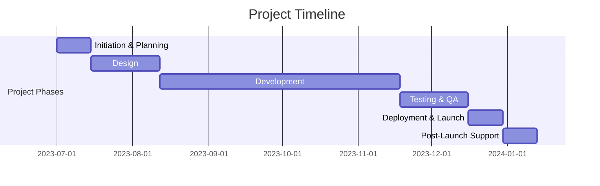
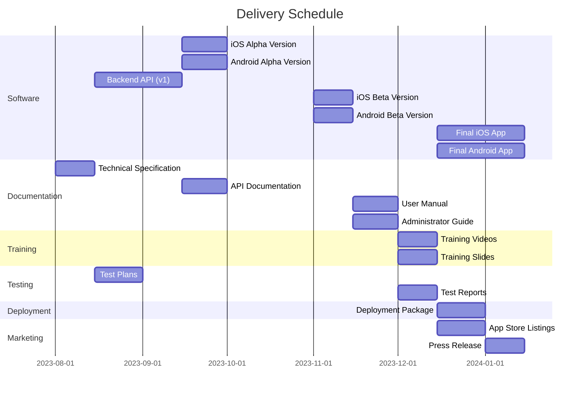

## EXECUTIVE SUMMARY

### PROJECT OVERVIEW

Our agency proposes to develop a cutting-edge mobile application tailored for venture capitalists to revolutionize their investment discovery process. This sophisticated tool addresses the critical challenge faced by VCs in identifying promising investment opportunities amidst an ever-growing sea of startups and emerging companies. By leveraging advanced algorithms and machine learning, the app will automate and enhance the process of spotting high-potential ventures across various sectors.

The solution will continuously monitor professional networks, aggregate real-time data from diverse sources, and deliver intelligent insights, effectively serving as a 24/7 virtual analyst. This will significantly reduce the time and resources VCs currently spend on manual research and initial screening, allowing them to focus on high-value activities such as due diligence and relationship building.

### OBJECTIVES

1. Streamline Investment Discovery: Automate the identification of promising companies based on customizable criteria.
2. Enhance Decision Making: Provide actionable insights and trend forecasts to support informed investment decisions.
3. Increase Efficiency: Reduce time spent on manual research by at least 50%.
4. Improve Deal Flow Quality: Increase the number of high-quality investment opportunities in the VC's pipeline by 30%.
5. Personalize User Experience: Deliver tailored alerts and recommendations based on individual VC preferences and strategies.
6. Ensure Data Security: Implement robust security measures to protect sensitive financial and business information.

### VALUE PROPOSITION

Our agency brings a unique combination of expertise and innovation to this project, offering:

1. **Deep Tech Expertise**: Our team's extensive experience in developing complex, data-driven applications ensures a robust and scalable solution.

2. **VC Industry Knowledge**: Our in-depth understanding of the venture capital landscape allows us to tailor the application to the specific needs and workflows of VCs.

3. **AI and ML Proficiency**: Our advanced capabilities in artificial intelligence and machine learning will power the app's intelligent insights and predictive analytics.

4. **User-Centric Design**: Our focus on creating intuitive, clean interfaces will ensure high adoption rates and user satisfaction among busy VC professionals.

5. **Continuous Innovation**: We commit to ongoing refinement and feature development based on user feedback and emerging technologies, ensuring the app remains at the cutting edge.

By partnering with our agency, venture capitalists will gain a powerful tool that not only streamlines their workflow but also provides a significant competitive advantage in identifying and capitalizing on investment opportunities.

## PROJECT OBJECTIVES

### BUSINESS GOALS

1. Increase VC Investment Efficiency:
   - Reduce time spent on manual research by 50%
   - Increase the number of high-quality investment opportunities in VC pipelines by 30%

2. Enhance Decision-Making Process:
   - Improve the accuracy of investment predictions by 25%
   - Reduce the time from initial discovery to investment decision by 40%

3. Expand Market Reach:
   - Increase the diversity of investment portfolios by identifying opportunities in emerging sectors
   - Enable VCs to discover and evaluate 3x more potential investments in the same timeframe

4. Boost User Adoption and Retention:
   - Achieve a 70% adoption rate among target VC firms within the first year
   - Maintain a 90% user retention rate after the first six months

### TECHNICAL GOALS

1. Develop a Robust Data Aggregation System:
   - Implement APIs and web scraping techniques to collect data from diverse sources
   - Ensure real-time data updates with a maximum lag of 5 minutes

2. Create an Advanced Machine Learning Model:
   - Develop and train AI algorithms to accurately predict investment potential
   - Implement a self-learning system that improves predictions based on user feedback and outcomes

3. Design a Scalable Cloud-Based Architecture:
   - Build a system capable of handling 10,000+ concurrent users without performance degradation
   - Ensure 99.99% uptime for the application

4. Implement Robust Security Measures:
   - Achieve SOC 2 Type II compliance within the first year of operation
   - Implement end-to-end encryption for all data transmissions and storage

5. Create an Intuitive User Interface:
   - Develop a responsive design that works seamlessly across mobile and tablet devices
   - Achieve a System Usability Scale (SUS) score of 85 or higher

### SUCCESS CRITERIA

| Criterion | Target | Measurement Method |
|-----------|--------|---------------------|
| User Adoption | 70% of target VC firms in year 1 | User registration and active usage data |
| User Retention | 90% after 6 months | Monthly active user (MAU) tracking |
| Research Efficiency | 50% reduction in manual research time | User surveys and time tracking features |
| Investment Quality | 30% increase in high-quality opportunities | Number of opportunities progressing to due diligence |
| Prediction Accuracy | 25% improvement | Comparison of AI predictions to actual investment outcomes |
| Portfolio Diversity | 20% increase in investments in new sectors | Analysis of user investment data |
| System Performance | 99.99% uptime | Server logs and monitoring tools |
| User Satisfaction | System Usability Scale (SUS) score of 85+ | Regular user surveys |
| Security Compliance | SOC 2 Type II certification | Third-party audit |
| Financial Impact | 15% improvement in overall portfolio performance | Long-term tracking of user investment returns |

These success criteria will be regularly monitored and evaluated throughout the project lifecycle to ensure the application meets its intended objectives and delivers significant value to venture capitalists.

## SCOPE OF WORK

### IN-SCOPE

The following tasks, features, and functionalities are included in the project:

1. Mobile Application Development
   - Native iOS app development
   - Native Android app development
   - Cross-platform compatibility testing

2. User Interface and Experience Design
   - Custom UI/UX design tailored for VC users
   - Intuitive navigation and data visualization
   - Responsive design for various mobile devices

3. Backend Infrastructure
   - Cloud-based server setup and configuration
   - Database design and implementation
   - API development for data retrieval and processing

4. Data Aggregation and Processing
   - Implementation of data collection from various sources
   - Real-time data processing and analysis
   - Storage and management of large datasets

5. Machine Learning and AI Integration
   - Development of ML models for trend analysis and predictions
   - Implementation of AI-driven recommendation system
   - Continuous learning and model improvement mechanisms

6. User Authentication and Security
   - Secure user authentication system
   - End-to-end encryption for data transmission
   - Implementation of data privacy measures

7. Customization and Personalization Features
   - User profile creation and management
   - Customizable alert settings and preferences
   - Personalized dashboard and report generation

8. Integration Capabilities
   - Development of APIs for third-party integrations
   - Support for data export in common formats (CSV, JSON, etc.)

9. Analytics and Reporting
   - Implementation of robust analytics tools
   - Creation of customizable reports and visualizations
   - Comparative analysis features for multiple investments

10. Testing and Quality Assurance
    - Comprehensive testing of all features and functionalities
    - Performance testing and optimization
    - Security audits and vulnerability assessments

11. Deployment and Launch
    - App store submission and approval process management
    - Initial user onboarding and support
    - Monitoring and bug fixing post-launch

12. Documentation and Training
    - Creation of user manuals and help documentation
    - Development of training materials for VC users
    - Technical documentation for future maintenance and updates

### OUT-OF-SCOPE

The following items are explicitly excluded from the project scope:

1. Desktop application development
2. Web-based version of the application
3. Direct integration with VC firms' proprietary databases or systems
4. Provision of actual investment advice or recommendations
5. Legal or financial advisory services
6. Hardware procurement or setup for end-users
7. Ongoing content creation or data entry
8. Marketing or promotion of the application beyond initial launch
9. Long-term user support or help desk services
10. Custom feature development for individual VC firms

### ASSUMPTIONS

The project plan is based on the following assumptions:

1. The client will provide timely feedback and approvals at designated project milestones.
2. Access to necessary APIs and data sources will be available and maintained throughout the project.
3. The client will secure any required licenses or permissions for data usage and integration.
4. The project team will have continuous access to required development tools and environments.
5. The client will provide access to subject matter experts (SMEs) from the VC industry for consultation.
6. The existing mobile app stores (Apple App Store and Google Play Store) policies will remain stable.
7. The client will handle any necessary legal or compliance reviews.
8. The project will use current stable versions of all software and frameworks at the time of development.
9. The client will provide test users for beta testing phases.
10. Cloud service providers will maintain their service levels and pricing structures.

### DEPENDENCIES

The following dependencies could impact the project timeline or deliverables:

| Dependency Category | Specific Dependencies | Potential Impact |
|---------------------|------------------------|-------------------|
| External Services | - Reliability of API providers - Stability of cloud services - Integration with payment gateways | Could affect data aggregation, app performance, and monetization features |
| Client Resources | - Availability of VC industry SMEs - Timely client approvals - Recruitment of beta testers | May impact feature relevance, project timeline, and user acceptance |
| Technology Stack | - Updates to iOS and Android - Changes in ML frameworks - Evolution of database technologies | Could require code adjustments and re-testing |
| Regulatory Compliance | - Changes in data protection laws - Updates to financial regulations - Modifications in app store policies | May necessitate feature adjustments or additional compliance measures |

These dependencies will be closely monitored throughout the project lifecycle, with contingency plans developed to mitigate potential risks and ensure timely project delivery.

## BUDGET AND COST ESTIMATES

### COST BREAKDOWN

The following table provides a detailed breakdown of the project costs:

| Category | Description | Cost (USD) |
|----------|-------------|------------|
| Labor | Development Team (6 developers x 6 months) | $540,000 |
| | UI/UX Design Team (2 designers x 3 months) | $90,000 |
| | Project Manager (1 PM x 6 months) | $90,000 |
| | Quality Assurance Team (2 QA engineers x 3 months) | $90,000 |
| | DevOps Engineer (1 engineer x 6 months) | $72,000 |
| | Data Scientist (1 specialist x 4 months) | $80,000 |
| Software and Tools | Development tools and licenses | $15,000 |
| | Cloud services and hosting (for development and first year) | $50,000 |
| | Third-party APIs and services | $30,000 |
| Hardware | Development and testing devices | $20,000 |
| Marketing | Initial launch marketing campaign | $50,000 |
| Legal and Compliance | Legal review and compliance consulting | $30,000 |
| Contingency | 10% of total budget for unforeseen expenses | $115,700 |
| **Total** | | **$1,272,700** |

### PAYMENT SCHEDULE

The proposed payment schedule is tied to project milestones and deliverables:

| Milestone | Percentage | Amount (USD) | Estimated Date |
|-----------|------------|--------------|----------------|
| Contract signing | 20% | $254,540 | 2023-07-01 |
| Completion of design phase | 15% | $190,905 | 2023-08-15 |
| Alpha version delivery | 20% | $254,540 | 2023-10-01 |
| Beta version delivery | 20% | $254,540 | 2023-11-15 |
| App store submission | 15% | $190,905 | 2023-12-15 |
| Final delivery and launch | 10% | $127,270 | 2024-01-15 |

### BUDGET CONSIDERATIONS

Several factors could potentially impact the budget, and we have strategies in place to manage these risks:

1. **Scope Changes**: 
   - Risk: Client requests for additional features or changes in requirements.
   - Management: We have included a change request process. Any significant scope changes will be evaluated for their impact on the budget and timeline, with additional costs negotiated as needed.

2. **Technology Challenges**: 
   - Risk: Unforeseen technical difficulties, especially in AI and machine learning integration.
   - Management: The contingency budget is partly allocated for this. We also have access to additional expert resources if needed, though this may impact the timeline.

3. **Data Source Costs**: 
   - Risk: Unexpected increases in API or data source pricing.
   - Management: We have budgeted conservatively for third-party services. Long-term contracts will be negotiated where possible to lock in prices.

4. **Regulatory Compliance**: 
   - Risk: New regulations or compliance requirements in the fintech sector.
   - Management: Part of the legal budget is reserved for ongoing compliance monitoring. We may need to allocate additional resources if significant new regulations emerge.

5. **Extended Development Time**: 
   - Risk: Delays in development could extend the project timeline.
   - Management: Our agile methodology allows for flexible resource allocation. We can potentially fast-track certain phases if needed, though this may incur additional costs.

6. **Market Changes**: 
   - Risk: Shifts in the VC market could necessitate pivots in the app's focus.
   - Management: Our design is modular, allowing for adjustments. Major changes may require budget reallocation or additional funding.

7. **Cybersecurity Measures**: 
   - Risk: Evolving security threats may require enhanced protection measures.
   - Management: We have budgeted for robust security, but significant new threats may require additional investment in security features.

To mitigate these risks, we will:
- Conduct bi-weekly budget reviews
- Maintain open communication channels with the client for quick decision-making
- Utilize agile development practices to adapt to changes efficiently
- Continuously monitor industry trends and regulatory landscapes

By proactively managing these considerations, we aim to deliver the project within the proposed budget while maintaining the flexibility to address unforeseen challenges.

## TIMELINE AND MILESTONES

### PROJECT TIMELINE

The project is estimated to span approximately 6 months, divided into the following major phases:

### KEY MILESTONES

| Milestone | Description | Estimated Date |
|-----------|-------------|----------------|
| Project Kickoff | Initial meeting, team assembly, and project setup | 2023-07-01 |
| Design Approval | Completion and approval of UI/UX designs | 2023-08-15 |
| Alpha Release | First functional version for internal testing | 2023-10-01 |
| Beta Release | Feature-complete version for user acceptance testing | 2023-11-15 |
| App Store Submission | Submission of the app to iOS and Android app stores | 2023-12-15 |
| Public Launch | Official release of the app to the public | 2024-01-15 |

### CRITICAL PATH

The following tasks and activities are critical to maintaining the project schedule:

1. **Design Phase Completion** (Weeks 1-6)
   - User interface design
   - User experience flow mapping
   - Design approval from stakeholders

2. **Core Feature Development** (Weeks 7-16)
   - Data aggregation system implementation
   - Machine learning model development
   - User authentication and security features

3. **Integration and Testing** (Weeks 17-20)
   - Integration of all components
   - Comprehensive testing and bug fixing
   - Performance optimization

4. **App Store Submission and Approval** (Weeks 21-24)
   - Preparation of submission materials
   - Addressing any feedback from app store reviews
   - Final adjustments based on app store requirements

5. **Launch Preparation** (Weeks 25-26)
   - Marketing materials finalization
   - User onboarding process setup
   - Final security audits

To ensure the project remains on schedule:

- Regular progress reviews will be conducted weekly
- Any delays in critical path activities will trigger immediate resource reallocation
- Parallel development of non-critical path items will be leveraged to maintain flexibility
- Continuous communication with stakeholders will be maintained to quickly address any issues or changes

By closely monitoring these critical path elements and maintaining flexibility in our approach, we aim to deliver the project on time and to the highest quality standards.

## DELIVERABLES

### LIST OF DELIVERABLES

The following table provides a comprehensive list of all tangible outputs for the VC Investment Discovery Mobile Application project:

| Category | Deliverable | Description |
|----------|-------------|-------------|
| Software Components | iOS Application | Native iOS app for iPhone and iPad |
| | Android Application | Native Android app for smartphones and tablets |
| | Backend API | RESTful API for data processing and storage |
| | Database | Scalable database for storing user and investment data |
| | Machine Learning Models | AI models for trend analysis and predictions |
| Documentation | Technical Specification | Detailed documentation of system architecture and components |
| | API Documentation | Comprehensive guide for backend API usage |
| | User Manual | End-user guide for app features and functionality |
| | Administrator Guide | Guide for system administration and maintenance |
| Training Materials | User Training Videos | Series of tutorial videos for app usage |
| | User Training Slides | Presentation slides for in-person training sessions |
| | Admin Training Manual | Detailed guide for system administrators |
| Design Assets | UI Kit | Complete set of design assets and components |
| | Brand Guidelines | Guidelines for app branding and visual identity |
| Testing Artifacts | Test Plans | Comprehensive plans for all testing phases |
| | Test Cases | Detailed test cases for all app features |
| | Test Reports | Final reports on test results and bug fixes |
| Deployment Package | Deployment Guide | Step-by-step guide for app deployment |
| | Configuration Files | All necessary configuration files for deployment |
| Marketing Materials | App Store Listings | Optimized listings for iOS App Store and Google Play Store |
| | Press Release | Official press release for app launch |
| | Marketing Collateral | Digital assets for marketing campaigns |

### DELIVERY SCHEDULE

The following Gantt chart outlines the expected delivery schedule for each major deliverable:

### ACCEPTANCE CRITERIA

The following table defines the acceptance criteria for key deliverables:

| Deliverable | Acceptance Criteria |
|-------------|---------------------|
| iOS/Android Applications | - All specified features are fully functional - App performs without crashes on latest OS versions - UI matches approved designs - App passes all security tests - Performance meets or exceeds specified benchmarks |
| Backend API | - All endpoints are functional and properly documented - API handles specified load without performance degradation - All data validations are in place - Security measures (authentication, encryption) are implemented |
| Machine Learning Models | - Prediction accuracy meets or exceeds 85% in test scenarios - Models can process data within specified time limits - Integration with app is seamless |
| User Documentation | - Covers all app features and functions - Is clear, concise, and free of errors - Includes all specified sections (getting started, troubleshooting, etc.) - Approved by client's subject matter experts |
| Training Materials | - Cover all essential app functions - Are engaging and easy to follow - Compatible with specified delivery platforms - Receive positive feedback in pilot training sessions |
| Test Reports | - Cover all specified test cases - Clearly document any found issues and their resolutions - Provide evidence of thorough testing across different devices and scenarios |
| Deployment Package | - Includes all necessary components for successful deployment - Clear instructions that can be followed by the client's IT team - Successfully tested in a staging environment |
| Marketing Materials | - Adhere to provided brand guidelines - Accurately represent app features and benefits - Meet app store requirements for listings - Approved by client's marketing team |

Each deliverable will be reviewed against these criteria before being considered complete. Any deliverable not meeting these criteria will be revised until it meets the specified standards.