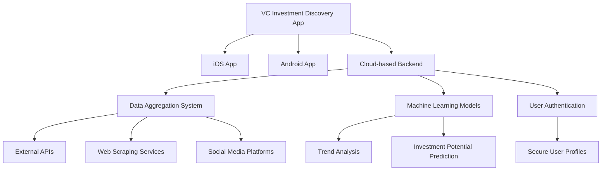
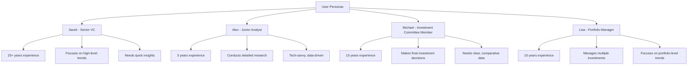
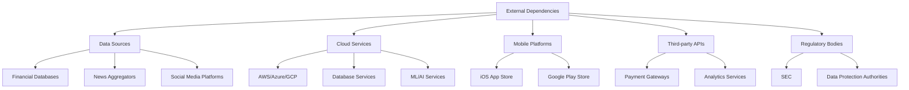
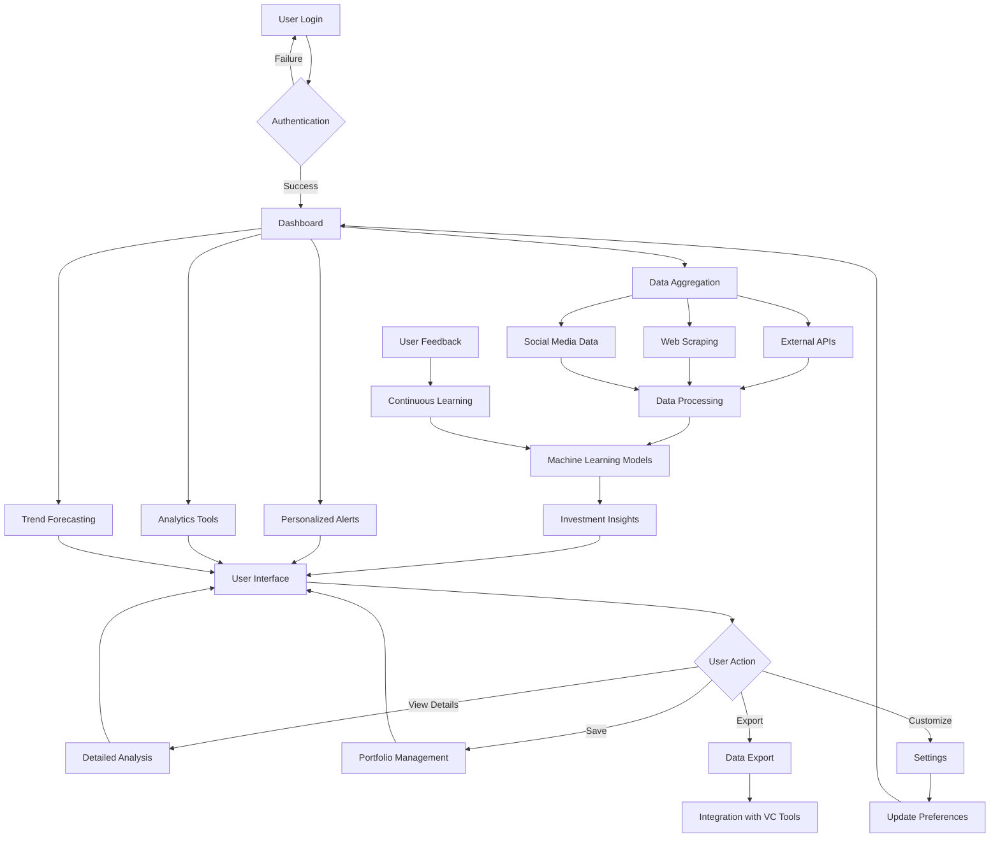
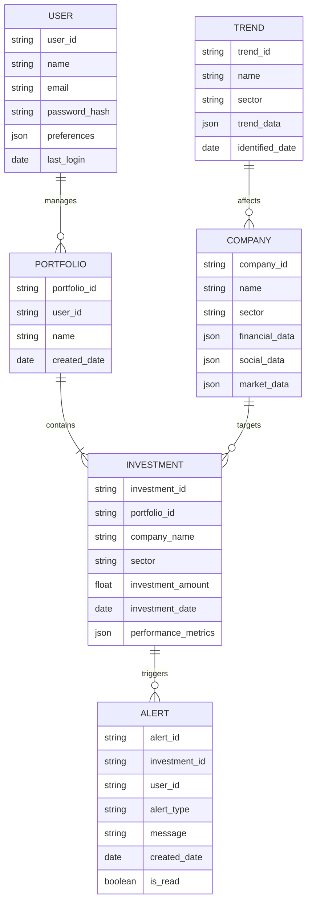
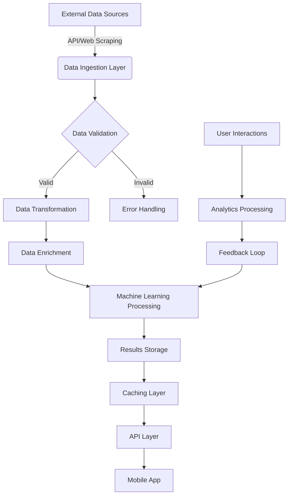

# 1. INTRODUCTION

## 1.1 PURPOSE

The purpose of this Software Requirements Specification (SRS) document is to provide a comprehensive and detailed description of the Venture Capital Investment Discovery Mobile Application. This document serves as the primary reference for the development team, project stakeholders, and quality assurance personnel throughout the software development lifecycle.

Specifically, this SRS aims to:

1. Define the functional and non-functional requirements of the mobile application.
2. Establish a clear understanding of the system's capabilities, constraints, and interfaces.
3. Serve as a basis for project planning, cost estimation, and resource allocation.
4. Provide a benchmark for validation and verification processes.
5. Facilitate communication between technical and non-technical stakeholders.

The intended audience for this document includes:

- Development Team: To guide the implementation of the software system.
- Project Managers: To plan and track project progress.
- Quality Assurance Team: To develop test plans and ensure the software meets specified requirements.
- Venture Capital Clients: To understand the system's capabilities and provide feedback.
- Maintenance and Support Teams: To understand the system for future updates and support.

## 1.2 SCOPE

The Venture Capital Investment Discovery Mobile Application is a sophisticated, AI-driven tool designed to revolutionize how venture capitalists identify, analyze, and track potential investment opportunities. This mobile application will be available on both iOS and Android platforms, leveraging advanced algorithms and machine learning to provide real-time insights and recommendations.

### Goals:

1. Streamline the investment discovery process for venture capitalists.
2. Enhance decision-making through data-driven insights and predictive analytics.
3. Increase the efficiency and effectiveness of VCs in identifying high-potential investment opportunities.
4. Provide a competitive edge to users by offering early identification of emerging trends and promising startups.

### Benefits:

1. Time Savings: Reduce manual research time by 50% through automated data aggregation and analysis.
2. Improved Deal Flow: Increase the number of high-quality investment opportunities by 30%.
3. Enhanced Decision Making: Provide data-backed insights to support more informed investment decisions.
4. Competitive Advantage: Early identification of emerging trends and promising startups.
5. Personalized Experience: Tailored alerts and recommendations based on individual VC preferences and strategies.

### Core Functionalities:

1. Continuous Network Monitoring:
   - Track professional networks for key indicators such as notable hires, funding announcements, and employee growth.
   - Aggregate real-time data from various sources including social media, press releases, and industry reports.

2. Intelligent Insights:
   - Deliver actionable insights highlighting emerging trends and investment potential.
   - Utilize machine learning to improve recommendations based on user interactions and preferences.

3. Personalized Alerts:
   - Allow users to set up customized alerts for activity related to companies of interest.
   - Provide timely notifications to ensure users never miss an opportunity.

4. Robust Analytics Tools:
   - Offer in-depth analysis capabilities for deep dives into company and market data.
   - Include comparison tools to evaluate multiple investment opportunities side-by-side.

5. Trend Forecasting:
   - Utilize historical data and machine learning to predict potential future trends in various sectors.
   - Help users identify emerging opportunities early to stay ahead of the curve.

6. Secure Data Handling:
   - Implement robust security measures to protect sensitive financial and business information.
   - Offer user authentication and data encryption to ensure privacy and confidentiality.

7. Integration Capabilities:
   - Allow for seamless integration with other professional tools and databases commonly used by VCs.
   - Support data export for further analysis or reporting purposes.

The application will be developed using native technologies for iOS (Swift) and Android (Kotlin), ensuring optimal performance and user experience on each platform. The backend will be built using a scalable, cloud-based architecture to handle real-time data processing and machine learning operations. By focusing on these core functionalities and leveraging cutting-edge technologies, the Venture Capital Investment Discovery Mobile Application aims to become an indispensable tool for modern venture capitalists, significantly enhancing their ability to identify and capitalize on promising investment opportunities.

# 2. PRODUCT DESCRIPTION

## 2.1 PRODUCT PERSPECTIVE

The Venture Capital Investment Discovery Mobile Application is a standalone software system designed to operate on iOS and Android mobile devices. While it functions independently, it interacts with various external systems and data sources to provide comprehensive investment insights to venture capitalists.

The application sits at the center of a complex ecosystem:

1. **Mobile Platforms**: Native apps for iOS and Android, leveraging platform-specific features for optimal performance and user experience.

2. **Cloud Infrastructure**: A scalable, cloud-based backend system that handles data processing, storage, and machine learning operations.

3. **Data Sources**: Integrates with various external APIs, web scraping services, and social media platforms to gather real-time data on companies, markets, and trends.

4. **Machine Learning Pipeline**: Utilizes advanced AI models for trend analysis and investment potential prediction, continuously improving through user interactions.

5. **Security Layer**: Implements robust authentication and encryption mechanisms to protect sensitive financial and user data.

6. **Integration Capabilities**: Offers APIs for potential future integrations with other VC tools and platforms.

This perspective emphasizes the app's role as a central hub for investment discovery, connecting various data sources and analytical tools to provide venture capitalists with a comprehensive, real-time view of potential investment opportunities.

## 2.2 PRODUCT FUNCTIONS

The Venture Capital Investment Discovery Mobile Application offers a range of sophisticated functions designed to streamline and enhance the investment discovery process for venture capitalists. The main functions include:

1. **Continuous Network Monitoring**
   - Track professional networks for key indicators (e.g., notable hires, funding announcements)
   - Aggregate real-time data from various sources (social media, press releases, industry reports)

2. **Intelligent Insights Generation**
   - Analyze aggregated data to identify emerging trends and investment potential
   - Utilize machine learning to improve recommendations based on user interactions and preferences

3. **Personalized Alert System**
   - Allow users to set up customized alerts for activity related to companies of interest
   - Deliver timely notifications to ensure users never miss an opportunity

4. **Advanced Analytics Tools**
   - Provide in-depth analysis capabilities for deep dives into company and market data
   - Offer comparison tools to evaluate multiple investment opportunities side-by-side

5. **Trend Forecasting**
   - Utilize historical data and machine learning to predict potential future trends in various sectors
   - Help users identify emerging opportunities early to stay ahead of the curve

6. **Secure Data Management**
   - Implement robust security measures to protect sensitive financial and business information
   - Provide user authentication and data encryption to ensure privacy and confidentiality

7. **Customizable Investment Criteria**
   - Allow users to set and adjust their own investment criteria and preferences
   - Tailor the discovery process to align with individual investment strategies and focus areas

8. **Integration and Export Capabilities**
   - Enable seamless integration with other professional tools and databases commonly used by VCs
   - Support data export for further analysis or reporting purposes

9. **User Profile and Portfolio Management**
   - Maintain secure user profiles with personalized settings and preferences
   - Track and manage a portfolio of potential and actual investments

10. **Interactive Data Visualization**
    - Present complex data sets through intuitive, interactive visualizations
    - Enable users to manipulate and explore data visually for better insights

These functions collectively provide a comprehensive toolset for venture capitalists to discover, analyze, and track potential investment opportunities more efficiently and effectively than traditional methods.

## 2.3 USER CHARACTERISTICS

The Venture Capital Investment Discovery Mobile Application is designed primarily for venture capital professionals with varying levels of experience and technical expertise. The main user groups and their characteristics are:

1. **Senior Venture Capitalists**
   - Extensive experience in investment decision-making
   - High-level strategic focus
   - Limited time for detailed analysis
   - May have lower technical proficiency
   - Require quick, high-level insights

2. **Junior Venture Capitalists / Analysts**
   - Responsible for initial screening and detailed research
   - More time for in-depth analysis
   - Generally higher technical proficiency
   - Need tools for comprehensive data gathering and analysis

3. **Investment Committee Members**
   - Require clear, concise information for decision-making
   - May have limited time to learn new tools
   - Focus on comparative analysis and risk assessment

4. **Portfolio Managers**
   - Track performance of multiple investments
   - Need tools for portfolio-level analysis and trend identification
   - Require features for managing and categorizing large sets of data

User Personas:

1. **Sarah - Senior VC**
   - 25+ years of experience in tech investments
   - Focuses on high-level trends and strategic decisions
   - Needs quick insights to support intuition-based decisions
   - Less comfortable with complex technical features

2. **Alex - Junior Analyst**
   - 3 years of experience, tech-savvy
   - Responsible for initial screening and due diligence
   - Comfortable with advanced features and data analysis
   - Seeks tools to enhance productivity and insight generation

3. **Michael - Investment Committee Member**
   - 15 years of experience across various sectors
   - Makes final investment decisions
   - Needs clear, comparative data for multiple opportunities
   - Values simplicity and clarity in data presentation

4. **Lisa - Portfolio Manager**
   - 10 years of experience in portfolio management
   - Tracks performance across multiple investments
   - Requires tools for identifying trends across the portfolio
   - Highly analytical, comfortable with advanced features

The application's design and functionality cater to these diverse user characteristics, providing both high-level insights for experienced VCs and detailed analytical tools for junior analysts, while maintaining an intuitive interface accessible to users with varying levels of technical proficiency.

## 2.4 CONSTRAINTS

The development and operation of the Venture Capital Investment Discovery Mobile Application are subject to several constraints:

1. **Technical Constraints**
   - Mobile Platform Limitations: Must adhere to iOS and Android platform guidelines and restrictions
   - Device Compatibility: Ensure functionality across a wide range of mobile devices with varying capabilities
   - Network Dependency: Requires stable internet connection for real-time data updates and analysis
   - Processing Power: Complex AI operations may be limited by mobile device processing capabilities

2. **Regulatory Constraints**
   - Data Privacy Laws: Must comply with GDPR, CCPA, and other relevant data protection regulations
   - Financial Regulations: Adhere to SEC guidelines and other financial industry regulations
   - App Store Policies: Meet all requirements for iOS App Store and Google Play Store

3. **Security Constraints**
   - Data Encryption: Implement end-to-end encryption for all sensitive data
   - Authentication: Enforce strict user authentication and access control measures
   - Third-party Integrations: Ensure security standards are maintained when integrating external services

4. **Budgetary Constraints**
   - Development Costs: Stay within the allocated budget of $1,272,700
   - Operational Costs: Manage ongoing expenses for cloud services, APIs, and maintenance within projected revenue

5. **Time Constraints**
   - Development Timeline: Complete development and launch within the 6-month project timeline
   - Market Timing: Meet the launch deadline to capitalize on current market opportunities

6. **Data Constraints**
   - Data Availability: Reliance on the availability and accuracy of external data sources
   - Data Volume: Handle and process large volumes of data within reasonable time frames
   - Data Freshness: Ensure data is as up-to-date as possible, given the limitations of data sources

7. **User Interface Constraints**
   - Screen Size: Design an effective UI for various mobile screen sizes and resolutions
   - Accessibility: Meet accessibility standards for users with disabilities
   - Usability: Maintain simplicity and intuitiveness while offering advanced features

8. **Scalability Constraints**
   - User Load: Support up to 10,000 concurrent users without performance degradation
   - Data Growth: Manage increasing volumes of historical data without impacting system performance

9. **Integration Constraints**
   - API Limitations: Work within the constraints of third-party API rate limits and data structures
   - Compatibility: Ensure compatibility with commonly used VC tools and databases

10. **Legal Constraints**
    - Intellectual Property: Avoid infringement on existing patents or copyrights
    - Liability: Clearly communicate the app's role in investment decisions to mitigate legal risks

These constraints shape the development approach, feature set, and operational parameters of the application, requiring careful consideration and management throughout the project lifecycle.

## 2.5 ASSUMPTIONS AND DEPENDENCIES

The successful development and operation of the Venture Capital Investment Discovery Mobile Application rely on several assumptions and dependencies:

### Assumptions

1. **User Adoption**: Venture capitalists will be willing to adopt a new technology solution for investment discovery.

2. **Data Availability**: Sufficient public and licensed data will be available to provide meaningful insights.

3. **AI Effectiveness**: Machine learning models will be able to provide accurate and valuable predictions based on available data.

4. **Market Stability**: The venture capital market will remain stable enough for the application to provide relevant insights.

5. **Technical Feasibility**: All proposed features can be implemented within the current state of mobile and cloud technologies.

6. **Regulatory Environment**: No major changes in financial regulations that would significantly impact the app's functionality.

7. **User Capability**: Target users have basic proficiency with mobile applications and financial technology.

8. **Scalability**: Cloud infrastructure will be able to handle growing data volumes and user base.

9. **Continuous Improvement**: Users will provide feedback for ongoing improvement of the application.

10. **Security Measures**: Implemented security measures will be sufficient to protect sensitive financial data.

### Dependencies

1. **Data Sources**
   - Reliability and continuity of financial databases, news aggregators, and social media platforms
   - Consistency in data formats and structures from various sources

2. **Cloud Services**
   - Availability and performance of chosen cloud provider (AWS, Azure, or GCP)
   - Scalability of cloud resources to meet growing demands

3. **Mobile Platforms**
   - Continued support for current iOS and Android versions
   - Approval processes for the iOS App Store and Google Play Store

4. **Third-party APIs**
   - Availability and reliability of integrated third-party services
   - Consistency in API structures and response formats

5. **Machine Learning Frameworks**
   - Ongoing support and updates for chosen ML libraries and frameworks
   - Compatibility of ML models with mobile and cloud environments

6. **Regulatory Compliance**
   - Ongoing compliance with financial regulations and data protection laws
   - Timely updates to adapt to any regulatory changes

7. **Development Tools**
   - Continued support and updates for development IDEs, testing tools, and CI/CD pipelines
   - Compatibility of development tools with chosen technologies

8. **User Feedback Channels**
   - Availability of beta testing platforms and user feedback tools
   - Engagement of user community for continuous improvement

9. **Payment Processing**
   - Reliability of payment gateways for subscription management
   - Compliance with financial transaction regulations

10. **Talent Availability**
    - Access to skilled developers, data scientists, and UX designers for ongoing development and maintenance

Understanding and managing these assumptions and dependencies is crucial for the project's success. Regular assessment and mitigation strategies should be in place to address any changes or challenges related to these factors throughout the project lifecycle.

Here's the PROCESS FLOWCHART section for the Venture Capital Investment Discovery Mobile Application using Mermaid JS, maintaining consistency with the previously mentioned technologies and frameworks:

## PROCESS FLOWCHART

The following flowchart illustrates the main processes of the Venture Capital Investment Discovery Mobile Application:

This flowchart represents the core processes of the application:

1. **User Authentication**: The process begins with user login and authentication.

2. **Dashboard**: Upon successful login, users are presented with their personalized dashboard.

3. **Data Aggregation**: The system continuously aggregates data from various sources, including external APIs, web scraping, and social media platforms.

4. **Data Processing**: Collected data is processed and prepared for analysis.

5. **Machine Learning Models**: Processed data is fed into machine learning models for analysis and prediction.

6. **Investment Insights**: The ML models generate investment insights based on the analyzed data.

7. **User Interface**: Insights, along with personalized alerts, analytics tools, and trend forecasts, are presented to the user through the interface.

8. **User Actions**: Users can perform various actions such as viewing detailed analyses, saving opportunities to their portfolio, exporting data, or customizing settings.

9. **Integration**: The app supports data export for integration with other VC tools.

10. **Continuous Learning**: The system continuously learns and improves based on user feedback and interactions.

This flowchart demonstrates the application's data-driven approach, leveraging AI and machine learning to provide valuable insights to venture capitalists. It also highlights the app's key features such as personalization, real-time data processing, and integration capabilities, all of which align with the previously outlined specifications and technologies.

Here's a breakdown of the Venture Capital Investment Discovery Mobile Application into features, maintaining consistency with the previously mentioned technologies and frameworks:

1. User Authentication and Profile Management

ID: F001
DESCRIPTION: Secure user authentication system with profile creation and management capabilities.
PRIORITY: High

TABLE OF FUNCTIONAL REQUIREMENTS:
| Requirement ID | Description |
|----------------|-------------|
| F001-1 | User registration with email and password |
| F001-2 | Two-factor authentication option |
| F001-3 | Password reset functionality |
| F001-4 | User profile creation and editing |
| F001-5 | Customizable investment preferences settings |

2. Data Aggregation and Processing

ID: F002
DESCRIPTION: Continuous monitoring and aggregation of data from various sources, including social media, press releases, and industry reports.
PRIORITY: High

TABLE OF FUNCTIONAL REQUIREMENTS:
| Requirement ID | Description |
|----------------|-------------|
| F002-1 | Integration with external APIs for data collection |
| F002-2 | Web scraping functionality for relevant websites |
| F002-3 | Real-time data processing and storage |
| F002-4 | Data normalization and cleaning |
| F002-5 | Scalable data storage solution using cloud services |

3. Intelligent Insights Generation

ID: F003
DESCRIPTION: AI-driven analysis of aggregated data to provide actionable insights and investment recommendations.
PRIORITY: High

TABLE OF FUNCTIONAL REQUIREMENTS:
| Requirement ID | Description |
|----------------|-------------|
| F003-1 | Machine learning model for trend analysis |
| F003-2 | AI-powered investment potential prediction |
| F003-3 | Personalized insights based on user preferences |
| F003-4 | Continuous learning and model improvement |
| F003-5 | Integration of insights into user interface |

4. Personalized Alert System

ID: F004
DESCRIPTION: Customizable alert system for notifying users about relevant activities and opportunities.
PRIORITY: Medium

TABLE OF FUNCTIONAL REQUIREMENTS:
| Requirement ID | Description |
|----------------|-------------|
| F004-1 | User-defined alert criteria setting |
| F004-2 | Push notification integration |
| F004-3 | Email alert option |
| F004-4 | Alert history and management |
| F004-5 | Frequency control for alerts |

5. Advanced Analytics Tools

ID: F005
DESCRIPTION: Robust set of analytics tools for in-depth analysis of companies and market data.
PRIORITY: High

TABLE OF FUNCTIONAL REQUIREMENTS:
| Requirement ID | Description |
|----------------|-------------|
| F005-1 | Interactive data visualization charts |
| F005-2 | Company financial analysis tools |
| F005-3 | Market trend analysis features |
| F005-4 | Competitor comparison functionality |
| F005-5 | Custom report generation |

6. Trend Forecasting

ID: F006
DESCRIPTION: Predictive analytics for identifying future trends in various sectors.
PRIORITY: Medium

TABLE OF FUNCTIONAL REQUIREMENTS:
| Requirement ID | Description |
|----------------|-------------|
| F006-1 | Historical data analysis for trend identification |
| F006-2 | Machine learning models for trend prediction |
| F006-3 | Sector-specific trend forecasts |
| F006-4 | Visual representation of predicted trends |
| F006-5 | Confidence levels for predictions |

7. Secure Data Handling

ID: F007
DESCRIPTION: Robust security measures to protect sensitive financial and business information.
PRIORITY: High

TABLE OF FUNCTIONAL REQUIREMENTS:
| Requirement ID | Description |
|----------------|-------------|
| F007-1 | End-to-end encryption for data transmission |
| F007-2 | Secure data storage with encryption at rest |
| F007-3 | Role-based access control |
| F007-4 | Regular security audits and penetration testing |
| F007-5 | Compliance with financial data protection regulations |

8. Integration Capabilities

ID: F008
DESCRIPTION: APIs and export functionalities for integration with other VC tools and databases.
PRIORITY: Medium

TABLE OF FUNCTIONAL REQUIREMENTS:
| Requirement ID | Description |
|----------------|-------------|
| F008-1 | RESTful API for data access |
| F008-2 | Data export in multiple formats (CSV, JSON, etc.) |
| F008-3 | Integration with popular CRM systems |
| F008-4 | Webhook support for real-time data sharing |
| F008-5 | OAuth 2.0 implementation for secure third-party access |

9. User Interface and Experience

ID: F009
DESCRIPTION: Clean, intuitive, and responsive user interface designed specifically for mobile devices.
PRIORITY: High

TABLE OF FUNCTIONAL REQUIREMENTS:
| Requirement ID | Description |
|----------------|-------------|
| F009-1 | Responsive design for various screen sizes |
| F009-2 | Customizable dashboard with drag-and-drop widgets |
| F009-3 | Dark mode option |
| F009-4 | Gesture-based navigation |
| F009-5 | Accessibility features compliance |

10. Offline Functionality

ID: F010
DESCRIPTION: Basic app functionality and data access in offline mode.
PRIORITY: Low

TABLE OF FUNCTIONAL REQUIREMENTS:
| Requirement ID | Description |
|----------------|-------------|
| F010-1 | Offline data caching |
| F010-2 | Sync functionality when connection is restored |
| F010-3 | Offline report viewing |
| F010-4 | Limited search capabilities in offline mode |
| F010-5 | Clear indication of offline status to users |

This feature breakdown maintains consistency with the previously mentioned technologies, including native iOS and Android development, cloud-based backend, machine learning integration, and robust security measures. The features are prioritized based on their importance to the core functionality of the Venture Capital Investment Discovery Mobile Application.

# 3. NON-FUNCTIONAL REQUIREMENTS

## 3.1 PERFORMANCE

The Venture Capital Investment Discovery Mobile Application must meet the following performance requirements:

1. Response Time:
   - App launch time: Less than 2 seconds on devices released within the last 3 years
   - Screen transition time: Less than 0.5 seconds
   - Data retrieval from local storage: Less than 100 milliseconds
   - API response time: Less than 1 second for 95% of requests under normal load

2. Throughput:
   - The system must support at least 10,000 concurrent users without degradation in performance
   - The backend must be capable of processing at least 1,000 API requests per second

3. Resource Usage:
   - Mobile app memory usage: Less than 200MB on iOS and Android devices
   - Mobile app CPU usage: Less than 10% of device CPU during normal operation, and less than 30% during intensive tasks (e.g., data analysis)
   - Battery consumption: Less than 5% of battery per hour of active use

4. Data Processing:
   - Real-time data updates: New data should be reflected in the app within 5 minutes of being available from the source
   - Machine learning model predictions: Generated within 3 seconds for individual company analysis

5. Offline Performance:
   - Essential features must be accessible offline with cached data
   - Sync time upon reconnection: Less than 30 seconds for typical usage patterns

## 3.2 SAFETY

To ensure the safety of users and data in case of failure, the following requirements must be met:

1. Data Backup:
   - Automated daily backups of all user and system data
   - Backup retention period of at least 30 days
   - Ability to restore from backup within 4 hours

2. Fault Tolerance:
   - Implement redundancy in critical system components to ensure no single point of failure
   - Automatic failover mechanisms for database and server instances

3. Error Handling:
   - Graceful error handling with user-friendly error messages
   - Detailed error logging for troubleshooting without exposing sensitive information to users

4. Data Integrity:
   - Implement data validation checks to prevent corruption during processing or transmission
   - Use checksums or similar mechanisms to verify data integrity during backups and restores

5. Disaster Recovery:
   - Maintain a comprehensive disaster recovery plan
   - Conduct disaster recovery drills at least twice a year

6. Monitoring and Alerts:
   - Implement real-time monitoring of system health and performance
   - Set up automated alerts for critical system issues or anomalies

## 3.3 SECURITY

The application must implement the following security features:

1. Authentication:
   - Multi-factor authentication (MFA) support
   - Secure password policies (minimum length, complexity requirements)
   - Account lockout after multiple failed login attempts

2. Authorization:
   - Role-based access control (RBAC) for different user types
   - Principle of least privilege for all system components

3. Data Encryption:
   - Use of TLS 1.3 or higher for all data in transit
   - AES-256 encryption for all sensitive data at rest
   - Secure key management system for encryption keys

4. Privacy:
   - Compliance with GDPR, CCPA, and other relevant data protection regulations
   - User consent management for data collection and processing
   - Data anonymization for analytics and reporting purposes

5. Secure Development:
   - Regular security code reviews and penetration testing
   - Implementation of OWASP top 10 security controls
   - Secure API design with proper authentication and rate limiting

6. Mobile Security:
   - App code obfuscation to prevent reverse engineering
   - Secure local storage of sensitive data on mobile devices
   - Certificate pinning to prevent man-in-the-middle attacks

7. Audit Logging:
   - Comprehensive logging of all security-relevant events
   - Tamper-evident log storage

8. Third-party Security:
   - Regular security assessments of integrated third-party services
   - Secure API keys and credential management

## 3.4 QUALITY

The application must meet the following quality attributes:

1. Availability:
   - 99.9% uptime for the backend services (less than 8.76 hours of downtime per year)
   - Planned maintenance windows communicated at least 48 hours in advance

2. Maintainability:
   - Well-documented codebase with inline comments and external documentation
   - Modular architecture to facilitate easy updates and feature additions
   - Automated deployment processes for both mobile apps and backend services

3. Usability:
   - Intuitive user interface requiring minimal training for VC professionals
   - Consistency with platform-specific design guidelines (iOS Human Interface Guidelines and Android Material Design)
   - Accessibility features to support users with disabilities (e.g., VoiceOver, TalkBack compatibility)

4. Scalability:
   - Horizontal scalability of backend services to handle 100% increase in user base within 6 months
   - Efficient caching mechanisms to reduce database load
   - Asynchronous processing of non-time-critical tasks

5. Reliability:
   - Mean Time Between Failures (MTBF) of at least 720 hours for critical system components
   - Automated recovery procedures for common failure scenarios
   - Comprehensive error handling to prevent system crashes

6. Testability:
   - Minimum of 80% unit test coverage for all code
   - Automated UI testing for critical user journeys
   - Staging environment mirroring production for accurate testing

7. Localization:
   - Support for multiple languages and regions
   - Proper handling of different date, time, and currency formats

8. Performance Efficiency:
   - Optimal use of device resources (CPU, memory, battery)
   - Efficient data synchronization to minimize bandwidth usage

## 3.5 COMPLIANCE

The application must adhere to the following compliance requirements:

1. Legal Compliance:
   - Adherence to all applicable laws and regulations in target markets
   - Compliance with data protection laws including GDPR and CCPA
   - Adherence to financial regulations relevant to venture capital activities

2. Industry Standards:
   - Compliance with ISO/IEC 27001 for information security management
   - Adherence to NIST Cybersecurity Framework
   - Compliance with PCI DSS for handling of payment information (if applicable)

3. Mobile Platform Guidelines:
   - Compliance with Apple App Store Review Guidelines
   - Adherence to Google Play Store Developer Program Policies

4. Accessibility Standards:
   - Compliance with WCAG 2.1 Level AA standards
   - Adherence to platform-specific accessibility guidelines (iOS and Android)

5. Data Handling and Privacy:
   - Implementation of data retention and deletion policies in compliance with relevant regulations
   - Provision of transparency reports on data usage and sharing
   - Clear and easily accessible privacy policy and terms of service

6. Ethical AI:
   - Adherence to ethical AI principles in machine learning model development and deployment
   - Regular audits of AI models for bias and fairness

7. Open Source Compliance:
   - Proper management and disclosure of open-source software usage
   - Adherence to open-source license requirements

8. Regulatory Reporting:
   - Capability to generate reports required by financial regulatory bodies
   - Audit trails for all financial data processing

9. Environmental Compliance:
   - Adherence to green computing practices in server operations
   - Compliance with e-waste regulations for any hardware components

10. Continuous Compliance Monitoring:
    - Regular compliance audits and assessments
    - Automated compliance checking integrated into the development and deployment pipeline

By adhering to these non-functional requirements, the Venture Capital Investment Discovery Mobile Application will ensure high performance, robust security, excellent quality, and full compliance with relevant standards and regulations. This will provide a reliable, efficient, and trustworthy tool for venture capitalists to streamline their investment discovery process.

# 4. DATA REQUIREMENTS

## 4.1 DATA MODELS

The Venture Capital Investment Discovery Mobile Application will utilize the following data models to efficiently store and manage information:

This entity-relationship diagram illustrates the core data models and their relationships within the application. The models are designed to support the key features of the application, including user management, portfolio tracking, investment monitoring, and trend analysis.

## 4.2 DATA STORAGE

The application will utilize a combination of cloud-based storage solutions to ensure scalability, reliability, and performance:

1. **Primary Database**: Amazon Aurora PostgreSQL
   - Chosen for its compatibility with PostgreSQL and enhanced performance for cloud operations
   - Provides automatic scaling and high availability

2. **Caching Layer**: Amazon ElastiCache for Redis
   - Used to cache frequently accessed data and reduce database load
   - Improves response times for real-time data retrieval

3. **Data Warehouse**: Amazon Redshift
   - Used for storing historical data and performing complex analytics
   - Enables efficient querying of large datasets for trend analysis and reporting

### Data Retention

- User account data: Retained indefinitely while the account is active
- Investment data: Retained for 7 years after the investment is closed or the account is terminated
- Market and trend data: Retained indefinitely for historical analysis
- Application logs: Retained for 90 days for troubleshooting and auditing purposes

### Redundancy and Backup

1. **Database Replication**:
   - Amazon Aurora automatically replicates data across multiple Availability Zones
   - Read replicas will be used to distribute read traffic and improve performance

2. **Backup Strategy**:
   - Daily automated backups with 35-day retention period
   - Point-in-time recovery enabled for the past 35 days
   - Weekly full backups stored in Amazon S3 with 7-year retention for compliance

3. **Multi-Region Redundancy**:
   - Critical data will be asynchronously replicated to a secondary region for disaster recovery

### Recovery

1. **Database Recovery**:
   - Automated failover to a replica in case of primary instance failure
   - Recovery Time Objective (RTO): < 30 minutes
   - Recovery Point Objective (RPO): < 5 minutes

2. **Disaster Recovery**:
   - Cross-region recovery procedures in place
   - Regular disaster recovery drills conducted quarterly

3. **Data Integrity Checks**:
   - Automated checksums and data validation processes
   - Regular data integrity audits

## 4.3 DATA PROCESSING

The application will implement a robust data processing pipeline to handle the continuous influx of financial and market data:

### Data Security

1. **Encryption**:
   - All data in transit encrypted using TLS 1.3
   - Data at rest encrypted using AES-256
   - Encryption keys managed through AWS Key Management Service (KMS)

2. **Access Control**:
   - Implement Role-Based Access Control (RBAC) for all data access
   - Use AWS Identity and Access Management (IAM) for fine-grained permissions
   - Regular access audits and least privilege principle enforcement

3. **Data Anonymization**:
   - Personal Identifiable Information (PII) anonymized for analytics processing
   - Use of tokenization for sensitive data fields

4. **Secure Data Processing**:
   - All data processing occurs within private subnets of Amazon VPC
   - Implementation of VPC endpoints to prevent data from traversing the public internet

5. **Monitoring and Auditing**:
   - Real-time monitoring of data access and processing activities
   - Comprehensive audit logs stored in Amazon CloudWatch Logs
   - Automated alerts for suspicious activities or anomalies

6. **Compliance**:
   - Adherence to GDPR, CCPA, and other relevant data protection regulations
   - Regular compliance audits and assessments

7. **Secure Data Disposal**:
   - Automated data purging processes for expired data
   - Secure wiping of decommissioned storage devices

By implementing these data requirements, the Venture Capital Investment Discovery Mobile Application ensures robust, secure, and efficient handling of critical financial and market data, providing users with reliable and timely insights for their investment decisions.

# 5. EXTERNAL INTERFACES

## 5.1 USER INTERFACES

The Venture Capital Investment Discovery Mobile Application will feature a clean, intuitive, and responsive user interface designed specifically for iOS and Android mobile devices. The UI will prioritize ease of use and quick access to critical information for venture capitalists.

Key UI requirements include:

1. Responsive design adapting to various screen sizes (smartphones and tablets)
2. Support for both portrait and landscape orientations
3. Adherence to platform-specific design guidelines (iOS Human Interface Guidelines and Android Material Design)
4. Dark mode support for both iOS and Android
5. Accessibility features compliant with WCAG 2.1 Level AA standards

Main UI components:

1. Dashboard: Customizable overview of key metrics, recent alerts, and trending opportunities
2. Search and Filter: Advanced search functionality with multiple filtering options
3. Company Profiles: Detailed view of individual company information and metrics
4. Analytics Visualizations: Interactive charts and graphs for data analysis
5. Alert Center: Centralized location for all user-defined alerts and notifications
6. Settings: User profile and preference management

[Placeholder for Dashboard Mockup]

[Placeholder for Company Profile Mockup]

[Placeholder for Analytics Visualization Mockup]

The final UI design will be subject to user testing and iterative refinement based on feedback from venture capital professionals.

## 5.2 HARDWARE INTERFACES

As a mobile application, the software will primarily interact with the hardware components of iOS and Android devices. Key hardware interface requirements include:

1. Touch Screen:
   - Support for multi-touch gestures (pinch-to-zoom, swipe, etc.)
   - Precise touch detection for interactive charts and graphs

2. Camera:
   - Integration for scanning business cards or QR codes for quick data entry
   - Support for both front and rear cameras

3. Biometric Sensors:
   - Integration with fingerprint sensors and facial recognition (Face ID/Touch ID on iOS, Fingerprint/Face Unlock on Android) for secure authentication

4. GPS:
   - Access to device location services for geolocation-based features (e.g., nearby startup events)

5. Network Interfaces:
   - Support for cellular data connections (3G, 4G, 5G)
   - Wi-Fi connectivity
   - Bluetooth for potential future features (e.g., data sharing between devices)

6. Storage:
   - Access to device storage for caching data and storing user preferences

7. Push Notification System:
   - Integration with iOS and Android push notification services for real-time alerts

The application will use standard mobile OS APIs to interact with these hardware components, ensuring compatibility across a wide range of devices.

## 5.3 SOFTWARE INTERFACES

The Venture Capital Investment Discovery Mobile Application will interact with various software systems and components:

1. Mobile Operating Systems:
   - iOS: Latest version and two previous major versions
   - Android: API level 26 (Android 8.0) and above

2. Backend Services:
   - RESTful API built with Node.js and Express.js
   - GraphQL API for more complex data queries

3. Database Systems:
   - Amazon Aurora PostgreSQL for primary data storage
   - Amazon ElastiCache (Redis) for caching and real-time data

4. Machine Learning Services:
   - TensorFlow Serving for deploying machine learning models
   - Amazon SageMaker for model training and management

5. Authentication Services:
   - OAuth 2.0 for third-party authentication
   - JSON Web Tokens (JWT) for session management

6. Analytics and Monitoring:
   - Firebase Analytics for mobile app usage tracking
   - Amazon CloudWatch for backend monitoring and logging

7. Payment Processing:
   - Apple Pay for iOS in-app purchases
   - Google Pay for Android in-app purchases
   - Stripe API for additional payment processing

8. Cloud Storage:
   - Amazon S3 for storing and retrieving large datasets and user-generated content

9. Push Notification Services:
   - Apple Push Notification Service (APNs) for iOS
   - Firebase Cloud Messaging (FCM) for Android

10. Third-party APIs:
    - CrunchBase API for startup and funding data
    - LinkedIn API for professional network information
    - Twitter API for real-time social media trends

All software interfaces will be implemented using secure, well-documented APIs to ensure reliability and maintainability.

## 5.4 COMMUNICATION INTERFACES

The Venture Capital Investment Discovery Mobile Application will utilize various communication interfaces to ensure efficient data exchange and system integration:

1. Network Protocols:
   - HTTPS for all client-server communications
   - WebSocket for real-time data updates and notifications

2. API Formats:
   - RESTful API using JSON for data exchange
   - GraphQL for more complex and efficient data queries

3. Data Formats:
   - JSON for structured data exchange
   - Protocol Buffers for efficient binary serialization (used with gRPC for some microservices)

4. Authentication:
   - OAuth 2.0 for secure API authentication
   - JWT (JSON Web Tokens) for maintaining user sessions

5. Encryption:
   - TLS 1.3 for all data in transit
   - AES-256 for encrypting sensitive data at rest

6. Real-time Communication:
   - Server-Sent Events (SSE) for one-way real-time updates
   - WebSocket for bi-directional real-time communication

7. Push Notifications:
   - APNs (Apple Push Notification service) for iOS devices
   - FCM (Firebase Cloud Messaging) for Android devices

8. Offline Data Synchronization:
   - Implementation of a custom sync protocol using SQLite on the device and the backend database

9. File Transfer:
   - Multipart form-data for file uploads
   - Amazon S3 pre-signed URLs for secure, direct file downloads

10. Inter-App Communication:
    - Deep linking for iOS and Android to allow communication with other apps
    - Custom URL schemes for app-specific actions

11. API Rate Limiting:
    - Implementation of token bucket algorithm for API rate limiting

12. Compression:
    - GZIP compression for API responses to reduce data transfer

All communication interfaces will be designed with security, efficiency, and scalability in mind, ensuring robust and reliable data exchange between the mobile application, backend services, and third-party systems.

# 6. APPENDICES

## 6.1 GLOSSARY

- **Venture Capital (VC)**: A form of private equity financing provided by firms or funds to startups, early-stage, and emerging companies that have been deemed to have high growth potential.

- **Deal Flow**: The rate at which investment opportunities are presented to a venture capital firm.

- **Due Diligence**: A comprehensive appraisal of a business undertaken by a prospective buyer, especially to establish its assets and liabilities and evaluate its commercial potential.

- **Exit Strategy**: A planned approach to ending an investment, typically through selling the company or going public.

- **Unicorn**: A privately held startup company valued at over $1 billion.

- **Burn Rate**: The rate at which a company is losing money, typically expressed as a monthly rate.

- **Term Sheet**: A non-binding agreement setting forth the basic terms and conditions under which an investment will be made.

- **Cap Table**: A table providing an analysis of the founders' and investors' percentage of ownership, equity dilution, and value of equity in each round of investment.

- **Traction**: Measurable evidence of market demand for a product or service.

- **Pivot**: A structured course correction designed to test a new fundamental hypothesis about the product, strategy, and engine of growth.

## 6.2 ACRONYMS

- **API**: Application Programming Interface
- **AWS**: Amazon Web Services
- **CCPA**: California Consumer Privacy Act
- **CI/CD**: Continuous Integration/Continuous Deployment
- **CRM**: Customer Relationship Management
- **GDPR**: General Data Protection Regulation
- **IAM**: Identity and Access Management
- **IDE**: Integrated Development Environment
- **IoT**: Internet of Things
- **JWT**: JSON Web Token
- **KPI**: Key Performance Indicator
- **ML**: Machine Learning
- **MVP**: Minimum Viable Product
- **NDA**: Non-Disclosure Agreement
- **NLP**: Natural Language Processing
- **OAuth**: Open Authorization
- **PII**: Personally Identifiable Information
- **REST**: Representational State Transfer
- **ROI**: Return on Investment
- **SaaS**: Software as a Service
- **SDK**: Software Development Kit
- **SEO**: Search Engine Optimization
- **SLA**: Service Level Agreement
- **SME**: Subject Matter Expert
- **SQL**: Structured Query Language
- **SRS**: Software Requirements Specification
- **SSL**: Secure Sockets Layer
- **UI/UX**: User Interface/User Experience
- **VPC**: Virtual Private Cloud

## 6.3 ADDITIONAL REFERENCES

1. Ries, E. (2011). The Lean Startup: How Today's Entrepreneurs Use Continuous Innovation to Create Radically Successful Businesses. Crown Business.

2. Blank, S. & Dorf, B. (2012). The Startup Owner's Manual: The Step-By-Step Guide for Building a Great Company. K&S Ranch.

3. National Venture Capital Association. (2021). NVCA Yearbook 2021. Available at: https://nvca.org/research/nvca-yearbook/

4. Gompers, P. A., & Lerner, J. (2004). The Venture Capital Cycle. MIT Press.

5. CB Insights. (2021). The Complete List Of Unicorn Companies. Available at: https://www.cbinsights.com/research-unicorn-companies

6. Crunchbase. (2021). Crunchbase Glossary of Funding Types. Available at: https://support.crunchbase.com/hc/en-us/articles/115010458467-Glossary-of-Funding-Types

7. TechCrunch. (2021). The TechCrunch Dictionary. Available at: https://techcrunch.com/glossary/

8. Amazon Web Services. (2021). AWS Documentation. Available at: https://docs.aws.amazon.com/

9. Google Cloud. (2021). Google Cloud Documentation. Available at: https://cloud.google.com/docs

10. Apple Inc. (2021). iOS Human Interface Guidelines. Available at: https://developer.apple.com/design/human-interface-guidelines/ios/

11. Google. (2021). Material Design. Available at: https://material.io/design

12. OWASP Foundation. (2021). OWASP Top Ten. Available at: https://owasp.org/www-project-top-ten/

These additional references provide valuable insights into venture capital, startup ecosystems, cloud technologies, mobile app development best practices, and security considerations that are relevant to the Venture Capital Investment Discovery Mobile Application project.