# 1. INTRODUCTION

## 1.1 SYSTEM OVERVIEW

The Venture Capital Investment Discovery Mobile Application is a sophisticated, AI-driven platform designed to revolutionize how venture capitalists identify, analyze, and track potential investment opportunities. This system comprises several interconnected components working in harmony to deliver real-time insights and actionable intelligence to users.

### High-Level System Architecture

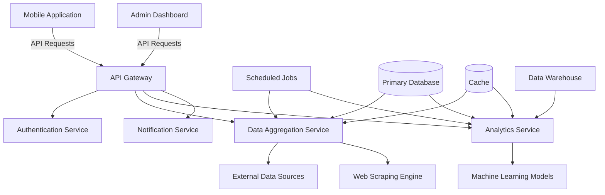

### Key Components

1. **Mobile Application**
   - Native iOS (Swift) and Android (Kotlin) applications
   - Responsive UI with real-time data updates
   - Offline capabilities for essential features

2. **API Gateway**
   - AWS API Gateway for request routing and API management
   - Implements rate limiting, authentication, and SSL termination

3. **Backend Services**
   - Microservices architecture using Node.js and Express.js
   - Containerized using Docker for easy deployment and scaling

4. **Data Aggregation Service**
   - Collects and processes data from various external sources
   - Implements a robust web scraping engine for unstructured data

5. **Analytics Service**
   - Hosts machine learning models for trend analysis and predictions
   - Utilizes TensorFlow for model serving

6. **Authentication Service**
   - Manages user authentication and authorization
   - Implements OAuth 2.0 and JWT for secure access

7. **Notification Service**
   - Handles push notifications and email alerts
   - Integrates with APNs for iOS and FCM for Android

8. **Admin Dashboard**
   - Web-based interface for system management and monitoring
   - Built with React.js for a responsive and interactive experience

9. **Databases**
   - Primary Database: Amazon Aurora PostgreSQL for transactional data
   - Cache: Amazon ElastiCache (Redis) for high-speed data access
   - Data Warehouse: Amazon Redshift for complex analytics and reporting

10. **External Integrations**
    - APIs: CrunchBase, LinkedIn, Twitter, etc.
    - Payment Gateways: Stripe, Apple Pay, Google Pay

11. **DevOps and Infrastructure**
    - AWS cloud infrastructure for scalability and reliability
    - CI/CD pipeline using Jenkins for automated testing and deployment
    - Monitoring and logging with Amazon CloudWatch

This system is designed to provide venture capitalists with a powerful, user-friendly tool that leverages cutting-edge technologies to streamline the investment discovery process. By integrating real-time data aggregation, advanced analytics, and machine learning, the application offers unparalleled insights into potential investment opportunities, helping users make informed decisions quickly and efficiently.

# 5. SYSTEM ARCHITECTURE

## 5.1 PROGRAMMING LANGUAGES

The Venture Capital Investment Discovery Mobile Application will utilize the following programming languages, chosen for their suitability to specific components of the system:

| Language | Component | Justification |
|----------|-----------|---------------|
| Swift    | iOS App   | Native language for iOS development, offering optimal performance and access to latest iOS features |
| Kotlin   | Android App | Modern language for Android development, fully interoperable with Java while offering more concise syntax |
| TypeScript | Backend Services | Superset of JavaScript with static typing, enhancing code quality and maintainability for server-side logic |
| Python   | Data Processing & ML | Rich ecosystem of libraries for data analysis and machine learning, including pandas, numpy, and scikit-learn |
| SQL      | Database Queries | Standard language for relational database operations, used with PostgreSQL |
| GraphQL  | API Layer | Efficient querying language for flexible and precise data fetching |

## 5.2 HIGH-LEVEL ARCHITECTURE DIAGRAM

The following diagram provides an overview of the system's main components and their interactions:

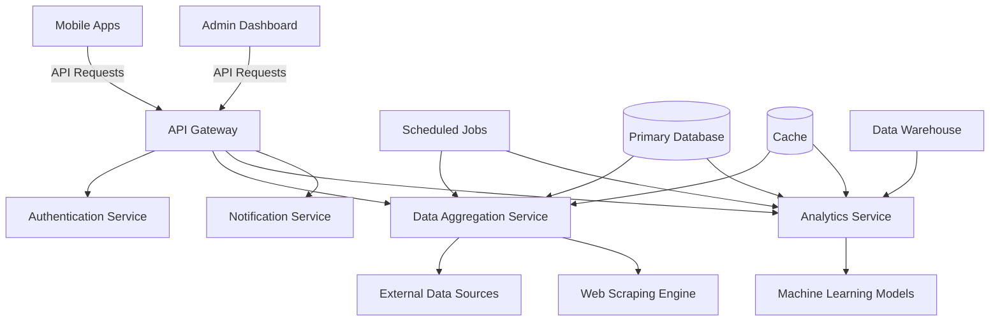

## 5.3 COMPONENT DIAGRAMS

### Mobile Application Components

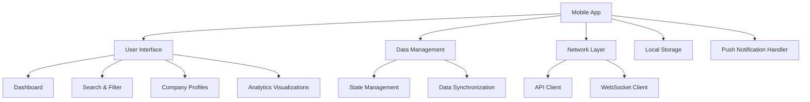

### Backend Service Components

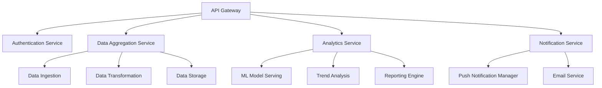

## 5.4 SEQUENCE DIAGRAMS

### User Authentication Flow

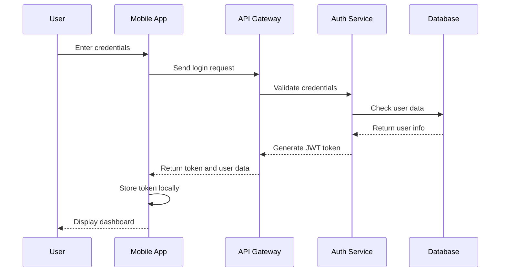

### Real-time Data Update Flow

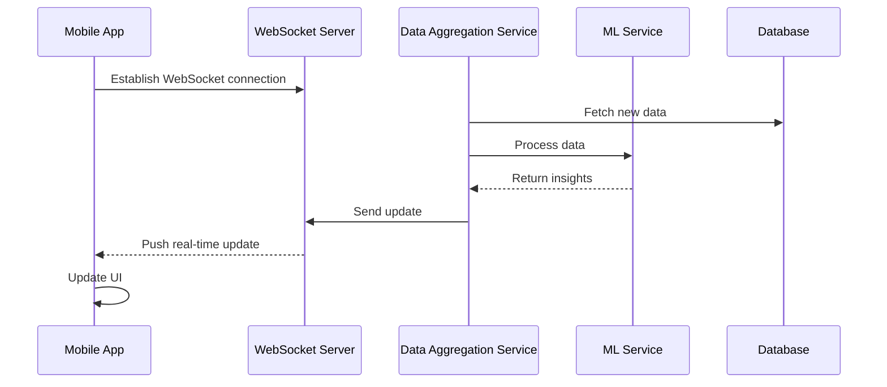

## 5.5 DATA-FLOW DIAGRAM

The following diagram illustrates how information moves through the Venture Capital Investment Discovery Mobile Application system:

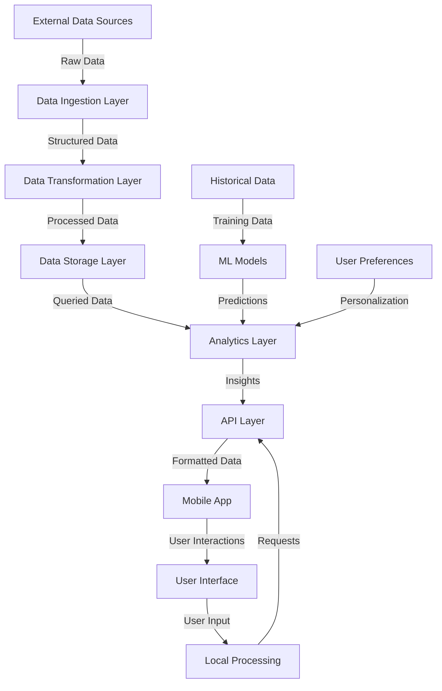

This data flow illustrates the journey of information from external sources through various processing stages, ultimately reaching the user interface. It also shows how user interactions and preferences influence the data processing and analytics layers, creating a feedback loop that continually improves the system's insights and recommendations.

The architecture described in this section ensures a scalable, maintainable, and efficient system that can handle the complex requirements of the Venture Capital Investment Discovery Mobile Application. By leveraging modern technologies and following best practices in software architecture, the system is designed to provide real-time insights, robust analytics, and a seamless user experience for venture capitalists.

# 5. SYSTEM DESIGN

## 5.1 PROGRAMMING LANGUAGES

The Venture Capital Investment Discovery Mobile Application will utilize the following programming languages, chosen for their suitability to specific components of the system:

| Language | Component | Justification |
|----------|-----------|---------------|
| Swift    | iOS App   | Native language for iOS development, offering optimal performance and access to latest iOS features |
| Kotlin   | Android App | Modern language for Android development, fully interoperable with Java while offering more concise syntax |
| TypeScript | Backend Services | Superset of JavaScript with static typing, enhancing code quality and maintainability for server-side logic |
| Python   | Data Processing & ML | Rich ecosystem of libraries for data analysis and machine learning, including pandas, numpy, and scikit-learn |
| SQL      | Database Queries | Standard language for relational database operations, used with PostgreSQL |
| GraphQL  | API Layer | Efficient querying language for flexible and precise data fetching |

## 5.2 DATABASE DESIGN

The application will use Amazon Aurora PostgreSQL as the primary database. The database schema will be designed to efficiently store and retrieve data for venture capital investment discovery. Here's a high-level overview of the main tables and their relationships:

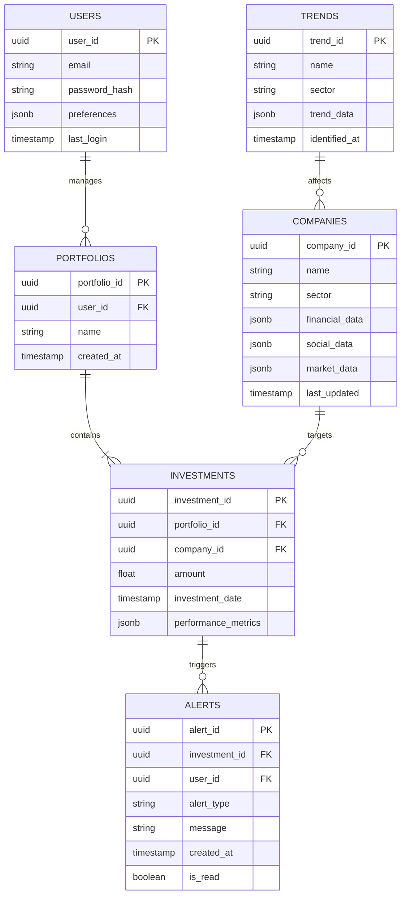

This schema allows for efficient querying of user portfolios, investments, company data, and related alerts and trends. The use of UUID as primary keys enhances data privacy and security.

## 5.3 API DESIGN

The API will be designed using RESTful principles and GraphQL to provide flexible and efficient data access. Here's an overview of the main API endpoints:

### RESTful API Endpoints

```
/api/v1/users
/api/v1/portfolios
/api/v1/investments
/api/v1/companies
/api/v1/alerts
/api/v1/trends
```

Each endpoint will support standard HTTP methods (GET, POST, PUT, DELETE) for CRUD operations.

### GraphQL Schema

```graphql
type Query {
  user(id: ID!): User
  portfolio(id: ID!): Portfolio
  investment(id: ID!): Investment
  company(id: ID!): Company
  alerts(userId: ID!): [Alert]
  trends(sector: String): [Trend]
}

type Mutation {
  createPortfolio(input: PortfolioInput!): Portfolio
  addInvestment(input: InvestmentInput!): Investment
  updateCompanyData(input: CompanyUpdateInput!): Company
  markAlertAsRead(id: ID!): Alert
}

type User {
  id: ID!
  email: String!
  portfolios: [Portfolio]
}

type Portfolio {
  id: ID!
  name: String!
  investments: [Investment]
}

type Investment {
  id: ID!
  company: Company!
  amount: Float!
  date: String!
  performance: JSON
}

type Company {
  id: ID!
  name: String!
  sector: String!
  financialData: JSON
  socialData: JSON
  marketData: JSON
}

type Alert {
  id: ID!
  investment: Investment
  type: String!
  message: String!
  createdAt: String!
  isRead: Boolean!
}

type Trend {
  id: ID!
  name: String!
  sector: String!
  data: JSON
  identifiedAt: String!
}
```

This GraphQL schema allows for flexible querying and efficient data fetching, reducing over-fetching and under-fetching of data.

## 5.4 USER INTERFACE DESIGN

The user interface will be designed to provide a clean, intuitive, and responsive experience for venture capitalists. Here's an overview of the main screens and their functionalities:

1. Dashboard
   - Overview of portfolio performance
   - Recent alerts and notifications
   - Trending investment opportunities

2. Portfolio View
   - List of current investments
   - Performance metrics and charts
   - Quick actions (add investment, view details)

3. Company Profile
   - Detailed company information
   - Financial and social data visualizations
   - Investment history and projections

4. Trend Analysis
   - Sector-specific trend visualizations
   - Predictive analytics charts
   - Related companies and investment opportunities

5. Alert Center
   - List of all alerts and notifications
   - Filtering and sorting options
   - Quick actions (mark as read, view related investment)

6. Search and Discovery
   - Advanced search functionality with multiple filters
   - AI-powered recommendations
   - Save and track potential investments

The UI will be implemented using native components for iOS (UIKit) and Android (Jetpack Compose) to ensure optimal performance and platform-specific design consistency. The design will adhere to accessibility guidelines and support dark mode on both platforms.

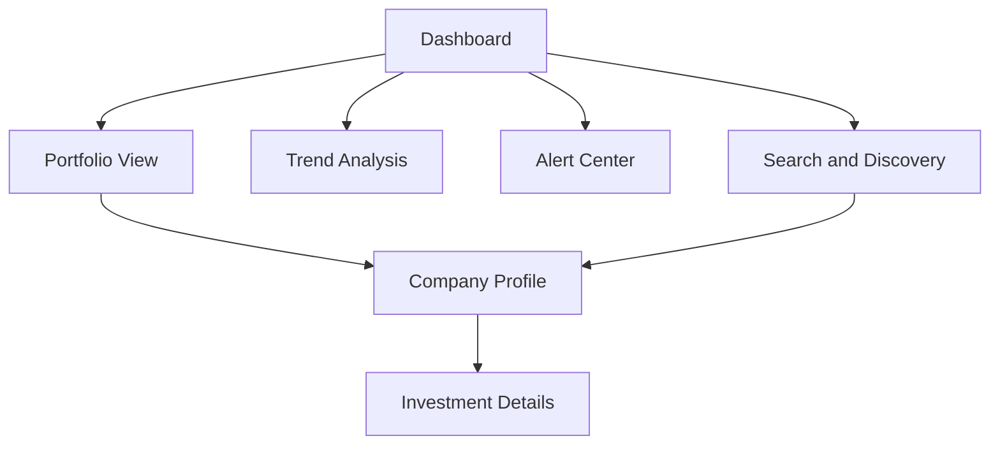

This diagram illustrates the main navigation flow between key screens in the application. The user interface will be designed to minimize the number of taps required to access important information, ensuring a smooth and efficient user experience for busy venture capitalists.

# 6. TECHNOLOGY STACK

## 6.1 PROGRAMMING LANGUAGES

The Venture Capital Investment Discovery Mobile Application will utilize the following programming languages:

| Language   | Component           | Justification |
|------------|---------------------|---------------|
| Swift      | iOS App             | Native language for iOS development, offering optimal performance and access to latest iOS features |
| Kotlin     | Android App         | Modern language for Android development, fully interoperable with Java while offering more concise syntax |
| TypeScript | Backend Services    | Superset of JavaScript with static typing, enhancing code quality and maintainability for server-side logic |
| Python     | Data Processing & ML| Rich ecosystem of libraries for data analysis and machine learning, including pandas, numpy, and scikit-learn |
| SQL        | Database Queries    | Standard language for relational database operations, used with PostgreSQL |
| GraphQL    | API Layer           | Efficient querying language for flexible and precise data fetching |

## 6.2 FRAMEWORKS AND LIBRARIES

The following frameworks and libraries will be utilized in the development of the application:

### Mobile Development
- iOS: SwiftUI, Combine
- Android: Jetpack Compose, Kotlin Coroutines

### Backend Development
- Node.js with Express.js for RESTful API
- Apollo Server for GraphQL API
- Jest for unit testing

### Data Processing and Machine Learning
- TensorFlow for machine learning model development and serving
- pandas and numpy for data manipulation and analysis
- scikit-learn for machine learning algorithms

### Frontend Libraries
- Charts.js for data visualization
- Alamofire (iOS) and Retrofit (Android) for network requests

### DevOps and Infrastructure
- Docker for containerization
- Kubernetes for container orchestration
- Jenkins for CI/CD pipeline

## 6.3 DATABASES

The application will employ the following database systems:

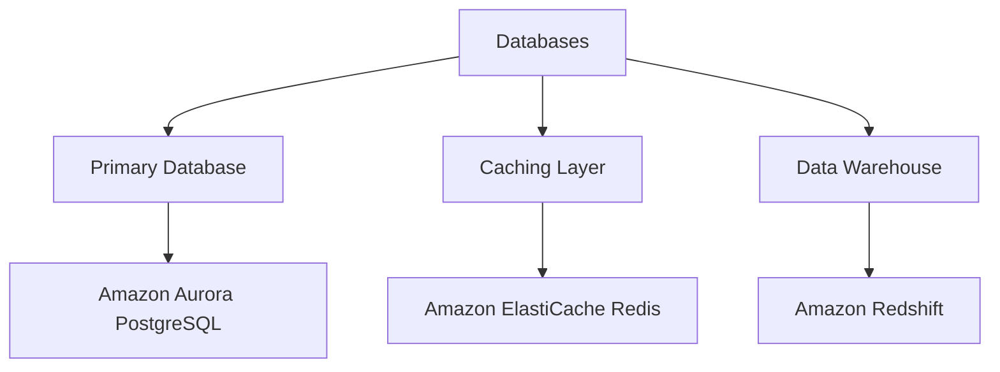

1. **Primary Database**: Amazon Aurora PostgreSQL
   - Chosen for its compatibility with PostgreSQL and enhanced performance for cloud operations
   - Provides automatic scaling and high availability

2. **Caching Layer**: Amazon ElastiCache for Redis
   - Used to cache frequently accessed data and reduce database load
   - Improves response times for real-time data retrieval

3. **Data Warehouse**: Amazon Redshift
   - Used for storing historical data and performing complex analytics
   - Enables efficient querying of large datasets for trend analysis and reporting

## 6.4 THIRD-PARTY SERVICES

The application will integrate the following external services and APIs:

1. **Authentication and Authorization**
   - Auth0 for user authentication and identity management

2. **Payment Processing**
   - Stripe API for subscription management and payment processing

3. **Push Notifications**
   - Firebase Cloud Messaging (FCM) for Android
   - Apple Push Notification service (APNs) for iOS

4. **Analytics and Monitoring**
   - Google Analytics for mobile app usage tracking
   - Amazon CloudWatch for backend monitoring and logging

5. **Data Sources**
   - CrunchBase API for startup and funding data
   - LinkedIn API for professional network information
   - Twitter API for real-time social media trends

6. **Machine Learning and AI**
   - Amazon SageMaker for model training and management
   - Google Cloud Natural Language API for sentiment analysis

7. **Mapping and Location Services**
   - Google Maps API for geolocation features

8. **Email Services**
   - SendGrid for transactional emails

9. **File Storage**
   - Amazon S3 for storing and retrieving large datasets and user-generated content

10. **Content Delivery**
    - Amazon CloudFront for global content delivery and caching

This technology stack has been carefully selected to provide a robust, scalable, and efficient foundation for the Venture Capital Investment Discovery Mobile Application. It leverages industry-leading tools and services to ensure high performance, security, and reliability across all components of the system.

# 7. SECURITY CONSIDERATIONS

## 7.1 AUTHENTICATION AND AUTHORIZATION

The Venture Capital Investment Discovery Mobile Application will implement a robust authentication and authorization system to ensure secure access to user data and functionalities.

### Authentication

1. Multi-factor Authentication (MFA):
   - Implement MFA using a combination of:
     - Something the user knows (password)
     - Something the user has (mobile device)
     - Something the user is (biometric data)

2. OAuth 2.0 Integration:
   - Support OAuth 2.0 for third-party authentication (e.g., Google, LinkedIn)

3. JSON Web Tokens (JWT):
   - Use JWTs for maintaining secure, stateless user sessions

4. Biometric Authentication:
   - Integrate with device-specific biometric systems (Face ID, Touch ID for iOS; Fingerprint, Face Unlock for Android)

5. Password Policies:
   - Enforce strong password requirements (minimum length, complexity)
   - Implement password hashing using bcrypt with salt

### Authorization

1. Role-Based Access Control (RBAC):
   - Implement RBAC with the following roles:
     - Admin
     - VC Partner
     - Analyst
     - Read-only User

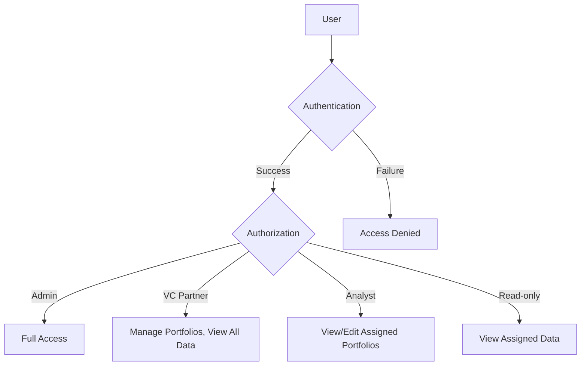

2. Principle of Least Privilege:
   - Grant users the minimum level of access required for their role

3. API Access Control:
   - Implement API key authentication for third-party integrations
   - Use OAuth 2.0 scopes to limit API access

4. Session Management:
   - Implement secure session handling with automatic timeout
   - Allow users to manage active sessions and revoke access

## 7.2 DATA SECURITY

Protecting sensitive financial and personal information is crucial for the Venture Capital Investment Discovery Mobile Application.

1. Encryption:
   - Implement end-to-end encryption for all data in transit using TLS 1.3
   - Use AES-256 encryption for data at rest

2. Data Classification:
   - Classify data based on sensitivity levels:
     - Public
     - Internal
     - Confidential
     - Highly Confidential

3. Data Anonymization:
   - Implement data anonymization techniques for analytics and reporting

4. Secure Data Storage:
   - Use Amazon Aurora PostgreSQL with encryption enabled
   - Implement secure key management using AWS Key Management Service (KMS)

5. Data Backup and Recovery:
   - Implement regular automated backups
   - Encrypt backups and store them in a separate, secure location

6. Data Access Logging:
   - Maintain comprehensive logs of all data access and modifications

7. Secure Data Transmission:
   - Use secure API endpoints (HTTPS only)
   - Implement certificate pinning to prevent man-in-the-middle attacks

8. Data Retention and Deletion:
   - Implement data retention policies in compliance with regulations
   - Provide secure data deletion mechanisms for user accounts

## 7.3 SECURITY PROTOCOLS

The following security protocols will be implemented to maintain system security:

1. Regular Security Audits:
   - Conduct quarterly internal security audits
   - Perform annual third-party penetration testing

2. Vulnerability Management:
   - Implement a vulnerability scanning and management process
   - Regularly update all system components and dependencies

3. Incident Response Plan:
   - Develop and maintain a comprehensive incident response plan
   - Conduct regular drills to test the effectiveness of the plan

4. Secure Development Lifecycle:
   - Implement secure coding practices
   - Conduct regular code reviews with a focus on security
   - Use static and dynamic application security testing (SAST/DAST) tools

5. Third-party Security:
   - Conduct security assessments of all third-party integrations
   - Implement a vendor risk management program

6. Network Security:
   - Use AWS Virtual Private Cloud (VPC) for network isolation
   - Implement Web Application Firewall (WAF) for API protection

7. Monitoring and Alerting:
   - Set up real-time security monitoring using Amazon CloudWatch
   - Implement automated alerting for suspicious activities

8. Security Training:
   - Provide regular security awareness training for all team members
   - Conduct specialized security training for developers

9. Compliance:
   - Ensure compliance with relevant standards (e.g., SOC 2, ISO 27001)
   - Regularly review and update security policies to meet regulatory requirements

10. API Security:
    - Implement rate limiting to prevent API abuse
    - Use API gateways for centralized security control

Security Protocols Overview:

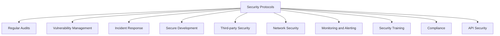

By implementing these security considerations, the Venture Capital Investment Discovery Mobile Application will maintain a robust security posture, protecting sensitive data and ensuring user trust. Regular reviews and updates to these security measures will be conducted to address evolving threats and maintain compliance with industry standards and regulations.